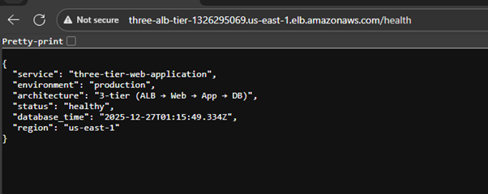
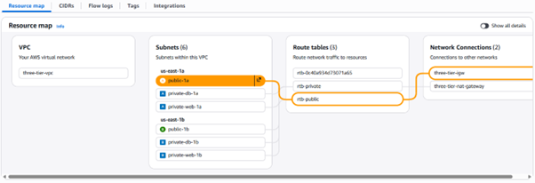
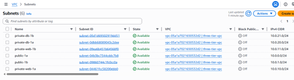
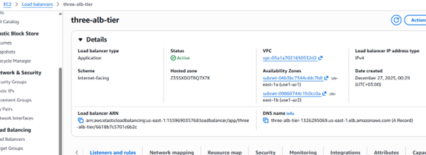
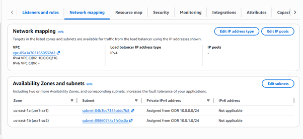
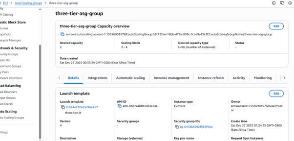
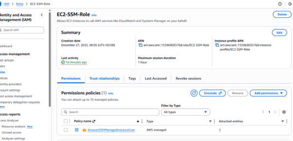
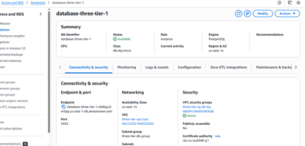

# AWS 3-Tier Architecture

End-to-end implementation of a highly available 3-tier AWS architecture with
Application Load Balancer (ALB), Auto Scaling, secure networking, and PostgreSQL backend.

---

## 🏗 Architecture Overview

## 🎯 Design Goals

- High availability across multiple Availability Zones
- Secure-by-design networking (no public DB or app access)
- Horizontal scalability using Auto Scaling Groups
- Separation of concerns across Web, App, and DB tiers
- Production-grade health checks and monitoring readiness

### Architecture Components
- **Route 53** – DNS routing (optional)
- **Application Load Balancer (ALB)** – Public entry point
- **Web Tier** – Nginx reverse proxy (Auto Scaling Group)
- **App Tier** – Node.js backend (Auto Scaling Group)
- **Database Tier** – Amazon RDS PostgreSQL (private subnets)
- **Networking**
  - Public & private subnets across multiple AZs
  - NAT Gateway for outbound internet access
  - Security Groups enforcing least privilege
 
  - ## 📸 Validation & Testing

Below are screenshots captured during testing **before resources were stopped**
(FinOps best practice to avoid unnecessary cost).

### ✅ ALB Health Endpoint
The Application Load Balancer successfully routes traffic to healthy targets.
The `/health` endpoint confirms end-to-end connectivity.

---

### ✅ VPC & Subnet Design
Multi-AZ VPC with public and private subnets, proper routing via IGW and NAT Gateway.

---

### ✅ Application Load Balancer Configuration
ALB deployed across multiple Availability Zones with correct network mapping.

---

### ✅ Auto Scaling Group
Auto Scaling Group configured with Launch Template, health checks, and desired capacity.

---

### ✅ Secure Access (SSM – No SSH)
EC2 instances are accessed securely using AWS Systems Manager Session Manager.
No inbound SSH ports are exposed.

---

### ✅ Database Connectivity
Private RDS PostgreSQL instance accessed securely from the application tier.

