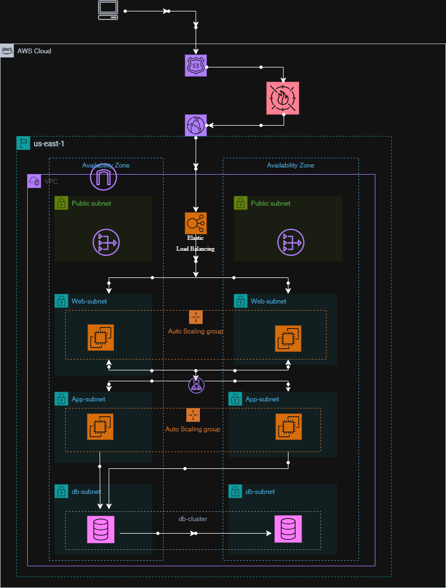

# AWS 3-Tier Architecture

End-to-end implementation of a highly available 3-tier AWS architecture with
Application Load Balancer (ALB), Auto Scaling, secure networking, and PostgreSQL backend.

---

## 🏗 Architecture Overview

## 🎯 Design Goals

- High availability across multiple Availability Zones
- Secure-by-design networking (no public DB or app access)
- Horizontal scalability using Auto Scaling Groups
- Separation of concerns across Web, App, and DB tiers
- Production-grade health checks and monitoring readiness

### Architecture Components
- **Route 53** – DNS routing (optional)
- **Application Load Balancer (ALB)** – Public entry point
- **Web Tier** – Nginx reverse proxy (Auto Scaling Group)
- **App Tier** – Node.js backend (Auto Scaling Group)
- **Database Tier** – Amazon RDS PostgreSQL (private subnets)
- **Networking**
  - Public & private subnets across multiple AZs
  - NAT Gateway for outbound internet access
  - Security Groups enforcing least privilege

